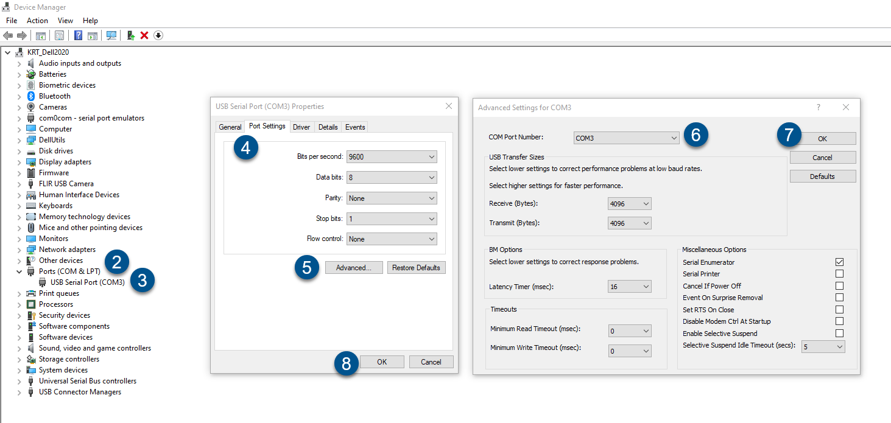

# Communication interface used for controlling VideometerLab Session
<!-- TOC -->
* [Overview](#Overview)
* [Generic C# controller for Session](#Generic-C#-controller-for-session)
  * [Start](#Start-Generic)
  * [Pause](#Pause-Generic)
  * [Finish](#Finish-Generic)
  * [New](#New-Generic)
  * [State Changed](#StateChanged-Generic)
  * [Last Image Failed](#Last-Image-Failed-Generic)
* [Python implementation for controlling Session](#Python-implementation-for-controlling-session)
  * [Initialize](#Initialize-Python)
  * [Capture Image](#CaptureImage-Python)
  * [Wait For Analysis Complete](#WaitForAnalysisComplete-Python)
  * [Wait For Sphere Up](#WaitForSphereUp-Python)
  * [Check If Last Image Failed](#CheckIfLastImageFailed-Python)
* [Python scripts](#Python-scripts)
  * [VideometerLabDevice.py](#VideometerLabDevice)
  * [CaptureImage.py](#CaptureImage)
  * [WaitForSphereUp.py](#WaitForSphereUp)
  * [DidLastImageFail.py](#DidLastImageFail)
  * [Suggested User Flow](#SuggestedUserFlow)
* [Technical details](#technical-details)
  * [Setup for making and using your own C# controller](#Setup-Edit-C#)
  * [Setup for use of Python controller](#Setup-Use-Python)
  * [Setup for making your own Python controller](#Setup-Edit-Python)
  * [Session state machine](#Session-state-machine)
<!-- TOC -->

# Overview
The communication protocol handles messages between the VideometerLab Session and an external controller. The external controller can for instance be a PLC, custom C# application, or custom Python scripts.

Videometer provides the following:
* An abstract C# class "SessionController" which anyone can inherit from and make a custom implementation.
* A C# implementation called "SerialSessionController" that communicates over a serial connection with Phyton scripts that can control the Session.
  * Corresponding Phyton scripts to control the Session.

Both implementations work by controlling the Session by calling methods on the "ISessionControllerListener" interface.

# Generic C# controller for Session
Below is listed the methods that are exposed by the generic C# controller that can be used to control Session from C# code.

## Start
Starts a new measurement. This corresponds to using the play/start button in the GUI. An image is captured, analysed and the result is shown on screen.
The command takes the following arguments:
* Sample Id
* Operator initials
* Comment
* Boolean indicating whether to suffix by timestamp

## Pause
Pauses the current measurement. This corresponds to using the pause button in the GUI. There are no arguments to this method.

## Finish
Finishes the current measurement. This corresponds to using the finish button in the GUI. There are no arguments to this method.

## New
Cleares the GUI and makes ready for beginning new measurements. This corresponds to using the new button in the GUI. There are no arguments to this method.

## State Changed
This method is called when ever the internal Session state changes. See diagram below.

## Last Image Failed
This method is called if the capture or analysis of an image fails. This can be used to transfer the error message to the external controller and have the external controller decide how to handle the error.

# Python implementation for controlling Session

This section explains an example of an external Session controller written in Python. The controller consists of two parts:
* A C# implementation called "SerialSessionController"
* Python scripts

It works by communicating over a serial connection between the "SerialSessionController" and the Python scripts.    
Both the "SerialSessionController" and the Python scripts can be edited and customized to your needs/application.
Both is supplied in the Releases section.

## Initialize
This method initializes the connection between the Python scripts and the VideometerLab instrument. If a connection can not be established it is retried a number of times. This behavior cna be controlled by parameters in the top of the file VideometerLabDevice.py.

## Capture Image
This method tells the VideometerLab instrument to capture an image. This image is analysed according to the loaded recipe. This method returns once the image have been captured and before the analysis begins.

## Wait For Analysis Complete
This method waits for the current analysis ot finish. If the VideometerLab instrument is currently analysing an image then this method waits for this analysis to finish. If the VideometerLab instrument is not currently analysing  an image this method returns immediately.  
A timeout parameter is provided the specifies the maximum time this method is allowed ot wait before throwing an exception.

## Wait For Sphere Up
This method waits until the VideometerLab sphere have moved all the way up. If the VideometerLab sphere is already in its up position then this method returns immediately.  
A timeout parameter is provided the specifies the maximum time this method is allowed ot wait before throwing an exception.

## Check If Last Image Failed
This method askes the VideometerLab software if the analysis of the previous image was successful or not. If the analysis of the previous image failed an exception is throw containing an error message. This error message is identical to the error message shown in the VideometerLab software. This method can be used to make automatic decisions on how to handle analysis errors based on the individual error message.

# Python scripts
Videometer provides a Python class called VideometerLabDevice as well as scripts that use this class. These scripts are provided open-source, free of charge and the user can freely customize them to their specific needs.

## VideometerLabDevice.py
This file contains a Python implementation that can be used to control the VideometerLab instrument. All variables are defined at the top of the file, and it is not generally needed to modify this file. All below scripts uses the VideometerLabDevice class defined in this file.

## CaptureImage.py
This script do the following:
* Connected to the VideometerLab instrument
* Waited for any ongoing analysis to finish
* Captures a new image and starts the analysis according to the loaded recipe
* Waits for the VideometerLab sphere to move all the way up

## WaitForSphereUp.py
This script do the following:
* Connected to the VideometerLab instrument
* Waits for the VideometerLab sphere to move all the way up

If the VideometerLab sphere is already all the way up then this script immediately.

## DidLastImageFail.py
This script do the following:
* Connected to the VideometerLab instrument
* Checks if the analysis of the previous image was successful or not.

If the analysis of the previous image failed an exception is throw containing an error message. This error message is identical to the error message shown in the VideometerLab software. This method can be used to make automatic decisions on how to handle analysis errors based on the individual error message. 

## Suggested User Flow
The Python scripts is written for an application where a robotic system is placing presenting samples to the VideometerLab instrument. This robotic system can execute the Python scripts as it means of communication with the VideometerLab instrument.  
The suggested user flow is as follows:
1. The human operator manually starte the Videometer Session and loaded the needed recipe
2. Before the robot presents the first sample to the VideometerLab instrument it calls the Python script "WaitForSphereUp.py" to ensure the VideometerLab sphere is up and thereby that the robot do not collide with the sphere.
3. The robot presents a sample in the VideometerLab instrument and moves away so the sphere can move down without colliding with the robot arm.
4. The robot calls the Python script "CaptureImage.py" to capture an image and start the analysis. Once the script returns the robot can safely remove the sample again.
5. Repeat from step 3.

Optionally a call to the Python script "DidLastImageFail.py" can be added between step 4 and 5 and any custom error handling be done here.

# Technical details

## Setup for making and using your own C# controller
In order to use make your own session controller in C# you simply have to make a new class and inherent from the abstract class "SessionController". You then compile your dll and copy it into the VideometerLab installation folder. When you start Session your external Session controller can now be used.  
An example of this can be found in the "SerialSessionController" class.

## Setup for use of Python controller
In order to use our Python controller you need to copy the dll "VM.Lab.Session.SerialSessionController.dll" into the VideometerLab installation folder. When you start Session you can now send commands to the VideometerLab instrument by executing the provided Python scripts.

Note that: 
* The Python scripts assume that the VideometerLab PC and the external PC is connected by a serial cable.
* You will need to adjust the COM port number in the top of the file "VideometerLabDevice.py" to be the COM port number of the VideometerLab device.
* You will need to change the COM port number assigned by Windows to COM2 for the COM port on the PC that is connected to the external controller.

The assigned COM port number is changed using these steps:
1) Open the Device Manager (Can be done by pressing the Windows Key + R. Type “devmgmt.msc” and press Enter.)
2) Expand the Ports (COM & LPT) section
3) Right-click the COM port and select Properties
4) Click the Port Settings tab
5) Click Advanced
6) Change the COM port number in the dropdown
7) Click OK
8) Click OK
9) If the COM port number is already in use restart your computer after following the above steps

## Setup for making your own Python controller
You can customize our Python scripts to your liking. In order to make your own Session controller for Python you can either:
* Simply use the "VM.Lab.Session.SerialSessionController.dll" as provided, but modify the Python scripts to your needs.
* Change the source code for the "SerialSessionController" class and modify the Python scripts to your needs.

You will need to import the Python library's "serial" and "time" to modify the VideometerLabDevice class.

## Session state machine
The diagram below slows the Session state machine. These state can be used for custom implementation of the Session controllers.

